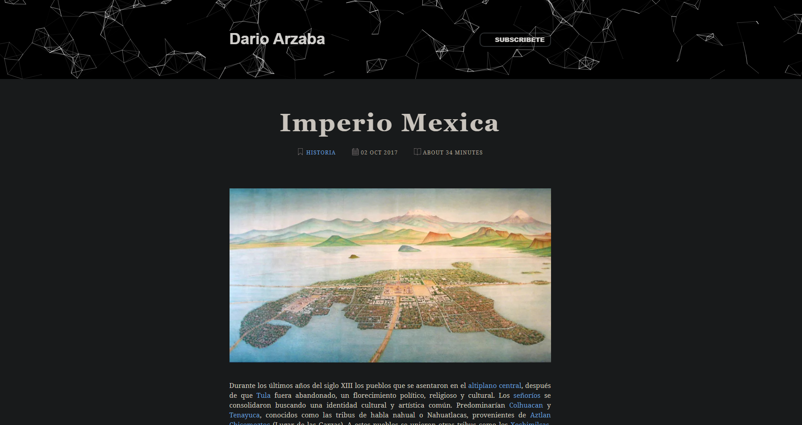
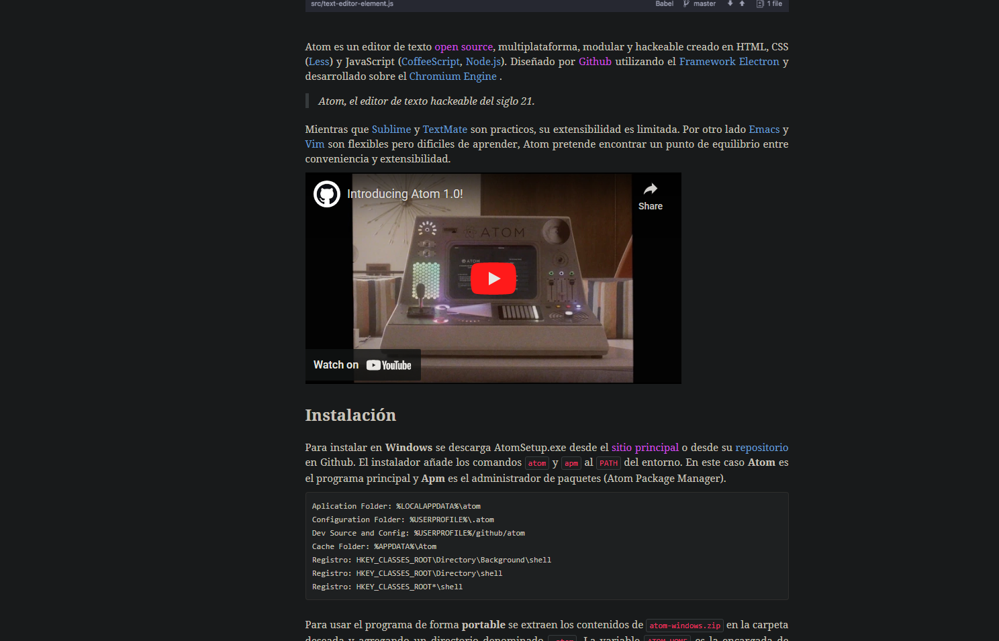

<br />
<div align="center">
  <a href="https://github.com/othneildrew/Best-README-Template">
    
  </a>

  <h3 align="center">My (Old) Personal Blog</h3>

  <p align="center">
    <a href="https://darioarzaba.github.io/"><strong>Explore the site »</strong></a>

  </p>
</div>

## About

You can read more about the technology behind this blog in my dedicated post:

* [Creating a Blog with Jekyll](https://darioarzaba.github.io/primero/2017/02/15/JekyllAdventures.html)

## Installation

1. Enable WSL and reboot
   ```sh
   Enable-WindowsOptionalFeature -Online -FeatureName Microsoft-Windows-Subsystem-Linux
   ```
2. Install [WSL Ubuntu](https://www.microsoft.com/es-mx/store/p/ubuntu/9nblggh4msv6?rtc=1)
3. Install ruby and jekyll gem
   ```sh
   sudo apt-get update -y && sudo apt-get upgrade -y
   sudo apt-add-repository ppa:brightbox/ruby-ng
   sudo apt-get update
   sudo apt-get install ruby2.3 ruby2.3-dev build-essential dh-autoreconf
   sudo gem update
   sudo gem install jekyll bundler
   jekyll -v
   ```
4. Build and deploy
   ```sh
   bundle install
   bundle exec jekyll serve
   ```

## Usage

</br>

<div align="center">
<p> Top of a post with js particle effect </p>
</div>



</br>

<div align="center">
<p> Videos, links and code blocks </p>
</div>



## License

Distributed under the [MIT License](https://mit-license.org/).

## Contact

Dario Arzaba - dario.arzaba@gmail.com